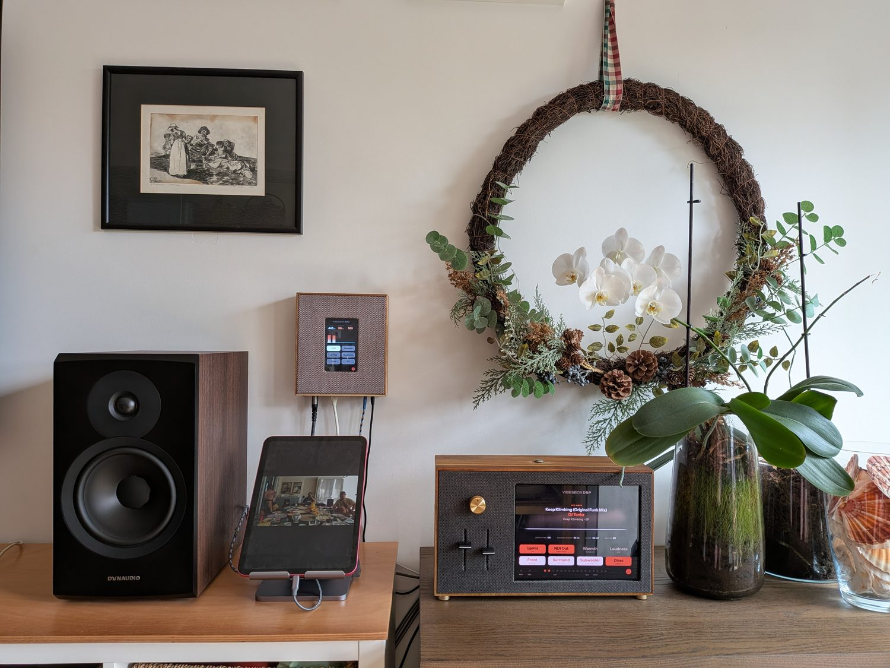
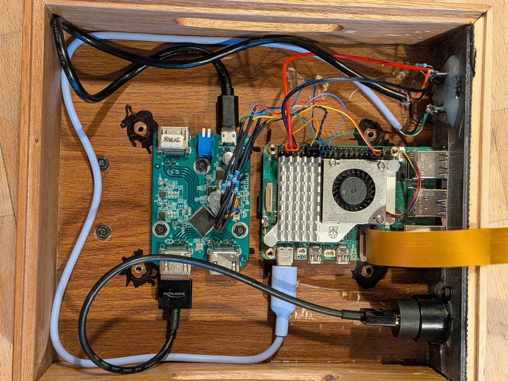
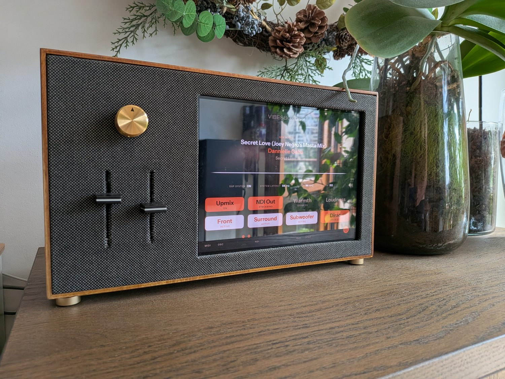
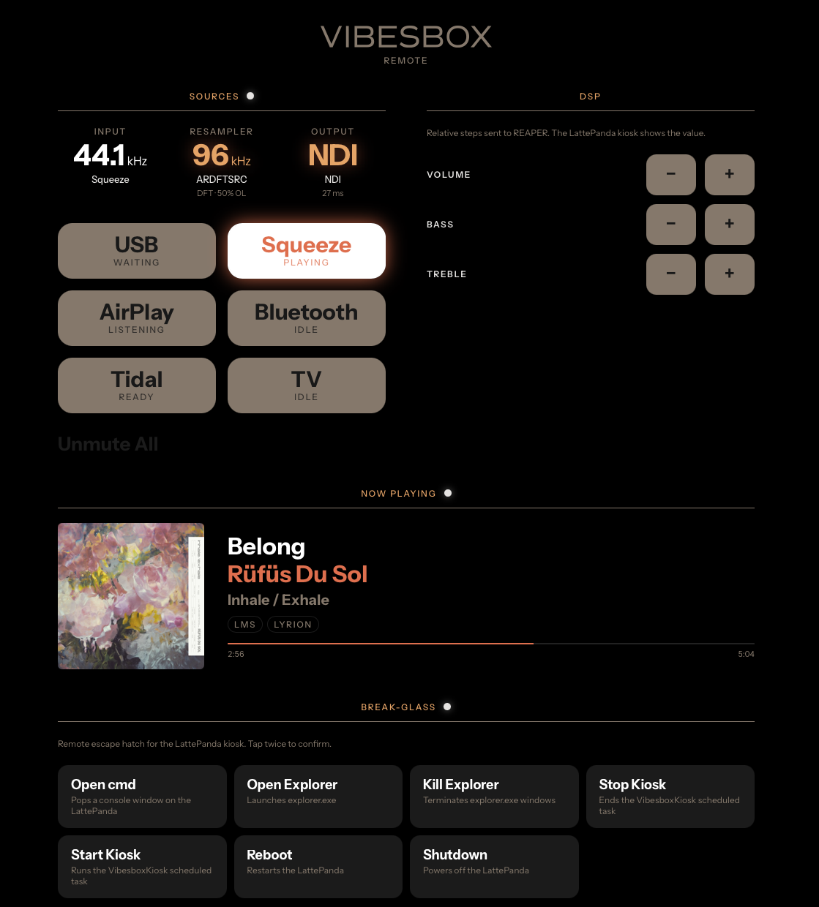

# VibesboxSRC

A Raspberry Pi 5 audio hub that takes every source in the house — USB, Lyrion, AirPlay,
Tidal, Bluetooth, and the TV over HDMI eARC — resamples each one to 96 kHz, sums them in a
PipeWire graph, and sends a single 6-channel 96 kHz stream out over the network as NDI.

It is one half of a two-box home audio system. This box normalises; a second box does the
DSP. It has been running as an appliance in a living room since 2026, not as a project that
gets demoed occasionally.



The wall-mounted panel on the left is this box. The unit on the sideboard is the DSP half.

## Why split it in two

The DSP half runs commercial VST3 plugins — Dirac Live for room correction, Penteo 360 for
stereo-to-surround upmixing — inside REAPER on Windows, because that is the only place
those plugins exist. An ASIO engine running a VST3 chain needs a **fixed, stable sample
rate**; if the rate changes, the whole clock domain resets and audio drops out.

Sources, meanwhile, change rate constantly. 44.1 kHz for most music, 48 kHz for video, 96
or 192 kHz for hi-res, and a TV that switches between 48 kHz LPCM and a 192 kHz compressed
bitstream depending on what is playing.

So this box exists to absorb all of that variation. Whatever happens upstream, the DSP unit
receives 96 kHz and never has to react to anything. Splitting the work this way is the
design, not a workaround.

```
 Sources                       Per-source     Graph              DSP                Output
 ────────────────────────      ──────────     ──────────────     ───────────────    ──────────────
 USB Host (UAC2, 44.1–192k) ─┐
 Lyrion / Squeezelite        │
 AirPlay / shairport         ├─▶ ardftsrc ─▶  PipeWire sum  ─▶   CamillaDSP    ──▶  NDI 5.1 (6ch)
 Tidal Connect               │   (→ 96 kHz)   (96 kHz; sums       (native PW;
 TV (eARC I2S tap)*          ┘                unmuted srcs)       6ch passthrough)
 Bluetooth (PW-native A2DP) ─────────────────▶      │

 source_router.py — activity detect · bridge lifecycle · PipeWire routing · per-source
 mute · Bluetooth mgmt · :8080 WebSocket ──▶ Touchscreen UI (800×480)

 * TV: LPCM stereo via ardftsrc, or IEC 61937 DD+/DD/DTS via the eARC decode bridge (6ch)
```

Two things about that diagram are worth stating explicitly, because they surprise people:

**Nothing is upmixed here.** A stereo source occupies FL/FR and the other four channels
carry silence all the way to the DSP unit. All upmixing and all channel routing happen
downstream. This box does not make creative decisions about the audio; it only makes the
timing uniform.

**Sources are summed, not switched.** Every unmuted, playing source is mixed together.
The UI exposes per-source mute toggles, and mute is implemented by unlinking the source
from the graph rather than by attenuating it.

## Reusable pieces

The whole system only makes sense if you want the thing it does, but several parts stand
alone and are probably why you are here:

| If you want… | Look at |
|---|---|
| Multichannel HDMI audio into a Pi 5, no capture card | [`config/overlays/`](config/overlays/) — device-tree overlay for a 4-lane I2S tap on an HDMI eARC extractor, plus the full pinout and what it took to get it working |
| High-quality per-source sample-rate conversion | [`ardftsrc-bridge-rs/`](ardftsrc-bridge-rs/) — small standalone Rust binary, ALSA in, PipeWire out |
| A PipeWire graph pinned to one rate that sums arbitrary sources | [`config/pipewire/`](config/pipewire/) and [`config/wireplumber/`](config/wireplumber/) |
| Decoding a DD+/DD/DTS bitstream captured as PCM | [`scripts/earc-bitstream-bridge.sh`](scripts/) and `tv_ac3_extract.py` |
| Multichannel audio over Ethernet with drift correction | [`scripts/ndi_transmitter.py`](scripts/) |

Every directory has a README explaining what it is and why it exists.
[`scripts/`](scripts/) is the best place to start reading code — `source_router.py` is the
component that knows the whole picture.

## Hardware

| Component | Model |
|---|---|
| SBC | Raspberry Pi 5 (2 GB) |
| Audio output | NDI over wired Ethernet — no audio HAT |
| Display | Waveshare 5" DSI touch LCD (800×480) |
| USB input | USB-C, UAC2 gadget mode via dwc2 |
| TV input | HDMI eARC extractor (Lindy 38368 / SiI9437), I2S tapped to GPIO |

Wired Ethernet is not optional. Wi-Fi causes audible dropouts on the NDI stream.

The Pi 5 specifically: capturing four I2S data lanes needs the RP1's `i2s1` instance. A Pi
4B's `bcm2835-i2s` gives you one data lane and two channels, which is not enough for the
eARC tap. Everything else in the project would run on a Pi 4B.



Inside the enclosure. The green board on the left is the HDMI eARC extractor; the ribbon of
coloured wires running to the Pi's GPIO header is the I2S tap, carrying the TV's audio
straight off the extractor's receiver chip. Everything is one box on a shared supply.

## The other half

The DSP unit (VibesboxDSP) is a LattePanda Mu running Windows 11 and REAPER, receiving
this box's NDI stream through an in-REAPER plugin whose asynchronous resampler continuously
corrects for drift between the two machines' independent clocks. It is a separate project
and is not published yet. Nothing here depends on it: the NDI stream is a standard one and
any NDI receiver can consume it.

The receiver plugin *is* public, at
[ndi-audio-receive](https://github.com/sofianchitac/ndi-audio-receive).



The DSP unit, receiving this box's stream. Its controls are all downstream decisions —
upmix, room correction, tone — which is exactly the split: this box decides nothing about
how the audio sounds, only that it arrives at a constant rate.

## Remote dashboard

`http://vibesbox-src.local/remote/` mirrors source state and Now Playing for any device on
the LAN, alongside DSP volume/tone nudges and a token-gated break-glass panel for
recovering the DSP unit remotely. Calls to the DSP unit are reverse-proxied by nginx so
they stay same-origin, which also means the dashboard never needs to know that machine's
address.



The header reads the signal chain left to right — the source's true native rate, what the
resampler is doing to it, and what is leaving the box. Here a 44.1 kHz Lyrion stream is
being converted to 96 kHz and sent as NDI. Sources show their own state independently
because any number of them can be audible at once.

## Installation

```bash
sudo bash install.sh   # Raspberry Pi OS Lite 64-bit (Trixie), Pi 5
sudo reboot
```

`install.sh` is long but linear, and prints what it did and what it skipped. It is
idempotent: per-deployment files (`tidal.env`, `nowplaying.env`, the break-glass
`config.json`) are seeded once from their `.example` templates and never overwritten.

If you run the DSP half too, set its hostname at install time:

```bash
DSP_HOST=my-dsp-box.local sudo bash install.sh
```

The **NDI SDK is not included** and cannot be redistributed — download it from
[ndi.video](https://ndi.video/for-developers/ndi-sdk/) and accept Vizrt's licence first.
`install.sh` checks for `/usr/local/lib/libndi.so` and, if it is missing, prompts for the
path to the SDK installer and unpacks it for you. NDI is the only output transport, so no
audio leaves the box without it.

Afterwards:

```bash
systemctl status pipewire wireplumber source-router camilladsp ndi-output greetd
journalctl -u source-router -f
```

## Status

Working and in daily use. There are no tests and no CI — it is a single-appliance project,
and the test is whether music plays. Expect the code to reflect that: comments explain why
a thing is the way it is, often referencing a specific failure that made it necessary.

## Licence

MIT — see [LICENSE](LICENSE).

Third-party components, none of which are vendored here, are listed in
[NOTICE.md](NOTICE.md) with their own licences.

> NDI® is a registered trademark of Vizrt NDI AB. This project is not sponsored by,
> endorsed by, or affiliated with Vizrt NDI AB.
