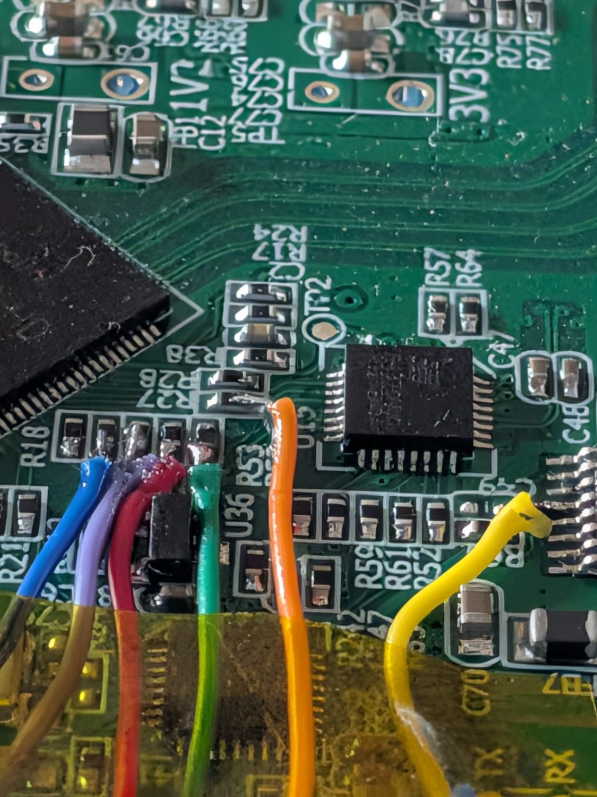

# Vibesbox device-tree overlays

## vibesbox-earc-tap — SiI9437 eARC I2S capture (Pi 5 only)

Captures multichannel LPCM from the SiI9437 eARC receiver inside the Lindy 38368
extractor, tapped as 6 wires straight onto the Pi 5 GPIO header
(pinout + board trace: [docs/Lattice/earc-i2s-tap-pinout.md](../../docs/Lattice/earc-i2s-tap-pinout.md)).
The RP1's `i2s1` instance runs as I2S **slave** — the SiI9437 masters BCLK/WS —
reading all four data lanes (up to 8ch).



The six wires, soldered directly to the SiI9437's pins — SCK, WS and the four data
lanes SD0–SD3. The tap has to be taken **at the chip**: on this board SD0 and the
SPDIF pin both feed a 74HC4052 analogue mux that time-shares one downstream input
between them, so what a given trace carries past that point depends on whether the
TV is sending LPCM or a bitstream. Upstream of the mux, each pin is unambiguous.

Colours here match the pin table in the
[pinout doc](../../docs/Lattice/earc-i2s-tap-pinout.md): orange SCK, green WS, yellow
SD0, blue SD1, purple SD2, red SD3. No level shifting is needed — the SiI9437's audio
pins are 2.8–3.6 V tolerant, which matches the Pi 5's 3.3 V domain.

**Status: VALIDATED ON HARDWARE 2026-07-27** (Pi 5, kernel `6.18.34+rpt-rpi-v8`).
Structure follows the kernel's `hifiberry-adc8x` overlay; the slave-instance
facts (rp1_i2s1 = `i2s_clk_consumer`, GPIO 18–27 carry the `i2s1` function,
DMA-driven RX) were verified by reading the rpi-6.12.y source on 2026-07-03 and
confirmed live.

### Codec node: `linux,spdif-dir`, NOT `snd-soc-dummy`

The HiFiBerry overlays create a `dummy-codec` node with
`compatible = "snd-soc-dummy"`, but **nothing in those overlays references it** —
their `__fixups__` never point at it. `snd-soc-dummy` has no OF match table, so
such a node never binds a driver. Harmless there; fatal here, because
`simple-audio-card` *does* reference its codec by phandle and therefore sits in
`-EPROBE_DEFER` forever with no card and no error in `dmesg`. The tell:

```bash
sudo cat /sys/kernel/debug/devices_deferred     # -> "asoc-simple-card: parse error"
readlink -f /sys/bus/platform/devices/earc-codec/driver   # -> absent
```

`linux,spdif-dir` (`snd_soc_spdif_rx`) is a real DT-bindable capture-only stub
with no hardware behind it. Measured effect: the merged CPU∩codec constraints
are `CHANNELS: [2 8]`, `RATE: [8000 384000]`, `FORMAT: S16_LE S24_LE S32_LE` —
i.e. the stub does not narrow what the DW DAI can do.

### Compile + install (on the Pi)

```bash
dtc -@ -I dts -O dtb -o vibesbox-earc-tap.dtbo vibesbox-earc-tap-overlay.dts
sudo cp vibesbox-earc-tap.dtbo /boot/firmware/overlays/
echo "dtoverlay=vibesbox-earc-tap" | sudo tee -a /boot/firmware/config.txt
sudo reboot
```

(`dtc` may warn about unit names / missing `reg` — those warnings are normal
for overlays and harmless.)

The overlay applies cleanly at **runtime** (`sudo dtoverlay vibesbox-earc-tap`) —
no reboot needed to test a change. `dtoverlay -r vibesbox-earc-tap` removes it
(the "memory leak will occur if overlay removed" warnings are the normal, benign
ones for a fragment that modifies existing nodes).

### Measured on first bring-up (2026-07-27)

`arecord -D hw:eARC,0 --dump-hw-params` reports `CHANNELS: [2 8]`,
`RATE: [8000 384000]`, `FORMAT: S16_LE S24_LE S32_LE`. A 5 s capture at
`-c 8 -f S32_LE -r 48000` returned exactly 7 680 044 bytes (= 5 × 48000 × 8 × 4
+ header) with no xruns:

| ch | lane | peak dBFS | rms dBFS | content |
|---|---|---|---|---|
| 1–2 | SD0 | −7.6 / −4.7 | −20.5 / −19.2 | live stereo, cross-correlation 0.37 |
| 3–8 | SD1–SD3 | silent | silent | exactly zero — TV was sending 2.0 |

Low byte of every S32 sample was `0x00`, confirming **24-bit left-justified in
S32 slots** as predicted. Lane→channel mapping beyond SD0 is still UNMEASURED —
it needs the TV actually sending 5.1 LPCM over eARC.

### Side effect: the eARC card takes an ALSA index at boot

At boot the DT platform card probes before the USB gadget, so `eARC` lands at
**card 2** and `UAC2Gadget` shifts 2 → 3. Verified harmless: everything that
touches the gadget addresses it by ALSA **id**, not index —
`ardftsrc-bridge@usb` opens `hw:UAC2Gadget`, `source_router.py`'s
`alsa_detect` matches the card name `UAC2Gadget`, and the loopbacks are pinned
by `snd-aloop` index. Post-reboot 2026-07-27: all 15 Vibesbox services active
(plus `usb-gadget.target` and `lattepanda-watcher.timer`), no failed units, no
source-router warnings. Don't introduce index-based ALSA references.

WirePlumber would otherwise publish this card as a bogus 2ch
`alsa_input.platform-soc_107c000000_sound.stereo-fallback` node — it cannot read
a channel map off an I2S slave DAI. Suppressed by the eARC block in
`config/wireplumber/wireplumber.conf.d/52-vibesbox-sources.conf`, same treatment
as USB and TOSLINK.

> **Note on `../tools/`:** the bench scripts referenced below are in
> [`tools/`](../../tools/) at the repository root — one-shot diagnostics, not part of the
> running system, so `install.sh` does not deploy them. Copy one to the Pi when you need
> it. See [`tools/README.md`](../../tools/README.md).

### Probing what the TV actually sends

`../tools/earc_probe.py` is one command per TV setting — it captures, then reports
bit-clock presence, the **measured** incoming sample rate (slave mode has no rate
autodetect, so a 96 k or 44.1 k source would otherwise silently look like
garbage), which lanes are live, and LPCM vs IEC 61937 with the codec name:

```bash
scp ../tools/earc_probe.py vibesbox@vibesbox-src.local:/tmp/
ssh vibesbox@vibesbox-src.local 'python3 /tmp/earc_probe.py -l "Netflix 5.1"'
ssh vibesbox@vibesbox-src.local 'python3 /tmp/earc_probe.py -r 96000 -k /tmp/x.wav'
```

Keep `-d` at its 10 s default: the rate estimate is biased low by `arecord`
startup (~1 % at 10 s, ~2.6 % at 3 s), and 44.1 k vs 48 k is only 8.1 % apart.

### Source sweep, 2026-07-27/28 — what the TV actually sends

Chain is **Chromecast with Google TV 4K → TV → eARC → Lindy → tap**.

| TV audio out | Content | Result at the tap |
|---|---|---|
| Bitstream | 5.1 | **E-AC-3 (DD+)**, IEC 61937, SD0, 192 kHz, rate lock 0.999× |
| PCM | stereo | LPCM, SD0, 48 kHz |
| PCM | 5.1 (two different clips) | **all 8 lanes digital zero**, clock still locked at 48 kHz |

The PCM/5.1 silence is not a tap or overlay fault — the bit clock stays locked
throughout. **Google TV devices output bitstream or *stereo* PCM; multichannel
LPCM is not an output mode they have**, so nothing in the chain ever converts
5.1 to PCM and the TV emits silence. Confirmed unchanged across a TV settings
change, a Lindy power-cycle/eARC re-handshake, and Lindy EDID = TV (output 1).
**Don't sweep TV audio settings looking for multichannel LPCM from this source.**

Consequence: the eARC route is a **compressed-bitstream route**, decoded on the
Pi — which is exactly what the optical route could never do. Optical carried
only legacy DD; DD+ collapsed to an attenuated 2.0 downmix
([[project_tv_optical_pico_bridge]]). Here DD+ arrives intact.

Streaming **Atmos needs no special handling**: YouTube/Netflix/Disney+ deliver it
as DD+ JOC — object metadata on a 5.1 core, data_type `0x15` — and ffmpeg's
`eac3` decoder decodes the core and ignores JOC, yielding the 5.1 bed. Only
TrueHD/MAT (`0x16`, local media players) is genuinely hard.

### L/R polarity: RESOLVED 2026-07-28, no test tones needed

IEC 61937 places Pa in subframe A and Pb in subframe B. `earc_probe.py` matches
`ch1 == 0xF872 AND ch2 == 0x4E1F` **at the same frame**, and it matched on two
independent captures. Inverted WS polarity would have landed those swapped and
the scan would have failed. **Channel 1 = left, confirmed by known-identity
signal.** The lane-map question is moot on the bitstream path (everything is 2ch
on SD0; channel order comes from the ffmpeg decoder) — the note below is kept
only for a future multichannel-LPCM source.

### Remaining bring-up steps

1. Put the TV on genuine multichannel LPCM (not DD/DD+ passthrough) and re-run
   the 8ch capture, then analyse it with `../tools/earc_analyze.py` (peak / RMS /
   low-byte / lag-0 correlation matrix, stdlib only — the Pi has neither `sox`
   nor `numpy`) to read off which lane carries which channel. `install.sh` does
   not deploy `../tools/`, so copy it over first:
   `scp ../tools/earc_analyze.py vibesbox@vibesbox-src.local:/tmp/ && ssh vibesbox@vibesbox-src.local 'python3 /tmp/earc_analyze.py /tmp/earc.wav 8'`
2. If eARC's order differs from `FL,FR,RL,RR,FC,LFE`, normalise to that on the Pi
   side — USB (iPad) and TV optical both already land on it so REAPER's single
   remap serves all three. Do not add a second REAPER remap. ffmpeg decodes
   E-AC-3 to `FL,FR,FC,LFE,SL,SR`, so the bitstream path needs this remap too.
4. If `arecord` blocks forever: no BCLK is arriving — the extractor isn't in
   I2S8 LPCM mode, or the tap wiring is off. Scope GPIO 18 first.
5. Compressed passthrough (DD/DD+) appears as IEC 61937 bursts, which the
   existing `tv_ac3_extract.py` chain already knows how to classify.

### End-to-end decode PROVEN 2026-07-28

`../tools/earc_61937_extract.py` (offline counterpart to the live
`scripts/tv_ac3_extract.py`) demuxed a 10 s tap capture, and ffmpeg decoded it
with no errors:

```
data_type 0x15 (eac3): 313 bursts -> 480768 bytes   # sync 0b 77 at offset 0
Stream #0:0: Audio: eac3, 48000 Hz, 5.1(side), fltp, 384 kb/s
```

Decoded to PCM, all six channels carry content (FL −6.3, FR −6.2, FC −8.5,
LFE −13.3, SL −6.2, SR −6.2 dBFS peak). Channel identity checked empirically
rather than taken from the declared layout — `earc_analyze.py`'s `hf` column
(first-difference RMS ratio, a cheap spectral-centroid proxy) put channel 4 at
**0.016** against 0.116–0.182 for every other channel, an order of magnitude
lower, i.e. LFE. **`FL,FR,FC,LFE,SL,SR` confirmed.** Read that column
relatively, never against an absolute threshold: real programme material sits
around 0.11–0.18 at 48 kHz, so everything looks "low" in isolation.

**★ GOTCHA — `Pd` units are not universal.** AC-3 and DTS express the burst
length in **bits**; E-AC-3 (0x15) and TrueHD/MAT (0x16) express it in **bytes**
(matches ffmpeg `spdifenc.c`). Getting it wrong is a slow bug to find: ffmpeg
still reports `eac3, 5.1(side)` and still estimates a duration — it just decodes
garbage at 1/8 the real bitrate. The tell is the byte count (60 KB vs 480 KB for
10 s at 384 kb/s) and `error decoding the audio block` / `expacc out-of-range`.

### IMPLEMENTED 2026-07-28 — eARC is now the TV source

The optical/Pico path was retired; `SOURCES["TV"]` now points at `hw:eARC`.
Files: `scripts/earc-bitstream-bridge.sh`, `services/earc-bitstream-bridge@.service`,
`scripts/tv_ac3_extract.py` (gained `eac3` + an `s32` input mode),
`ardftsrc-bridge-rs` (the `tv` source now reads `hw:eARC,0`; the old TOSLINK
`tv-optical` rollback config was retired 2026-08-03, archived to
`vibesbox-backups/`), and `source_router.py` (`_probe_earc` / `_update_tv_bridge`).

**Verified live 2026-07-28, both modes and the auto-switch:**

* LPCM — `TV: eARC lpcm detected -> start ardftsrc-bridge@tv.service`, bridge up
  at ~83 ms, `source.tv.ardftsrc` linked into `dsp-in` FL/FR.
* Auto-switch — playing 5.1 flipped it: `TV: eARC eac3 detected -> start
  earc-bitstream-bridge@eac3.service`, LPCM bridge torn down, no overlap.
* DD+ — all six ports linked into `dsp-in`, zero ffmpeg/pw-cat errors, and
  CamillaDSP capture RMS shows all six channels tracking content over time
  (−14 to −34 dB). A single instantaneous sample can show one channel near −75;
  that is programme material, not a dead channel — sample repeatedly.
* The streaming extractor produces **byte-identical** output to the offline
  `earc_61937_extract.py` on the same capture (480768 B, `0b 77` sync,
  `eac3 48000 Hz 5.1(side) 384 kb/s`).

Still untested: the eac3 → lpcm direction of the switch (it relies on the
extractor's `NO_BURST_TIMEOUT`, unchanged from the proven optical path).

**Reading the RMS: the channel order is deliberately scrambled.** ffmpeg decodes
canonically (`FL,FR,FC,LFE,RL,RR`), pw-cat labels those ports
`FL,FR,RL,RR,FC,LFE`, and `source_router` links by NAME — so `dsp-in` inputs 1-6
carry `FL,FR,RL,RR,FC,LFE` *content*. That is the same scramble the USB source
has, so REAPER's single existing remap serves both. Don't "fix" it on the Pi.

**How a bitstream kills the LPCM bridge.** Observed in the wild: the LPCM bridge
logs `capture unrecoverable, stopping` rather than tripping its IEC 61937
detector, because a 192 kHz DD+ stream against its 48 kHz open overruns the
capture faster than the detector confirms. Either way it exits 0, systemd does
not restart it (`Restart=on-failure`), and the next probe starts the right
bridge — so the outcome is correct. Don't read `capture unrecoverable` on the TV
source as a fault; on this source it is a format change.

Design notes kept from the port planning below, since they are the non-obvious parts.

### The port — `tv_ac3_extract.py` was extended, not forked

The eARC source is an IEC 61937 bitstream path, so clone the optical chain
(`scripts/tv_ac3_extract.py` + `tv-ac3-bridge.sh`). Its framing, the
codec-as-`argv[1]` pattern, and the self-exit-on-format-change →
`source_router` re-probe mechanism all transfer. Four real diffs:

1. **Sample unpacking.** The optical extractor reads `S16_LE` from the Pico.
   Here it is `S32_LE` with the 16-bit 61937 word at bits 31..16
   (`(v >> 16) & 0xFFFF`, as `earc_probe.py` does). The subsequent
   byte-swap-to-native-AC-3 step still applies.
2. **★ Rate changes WITH the format — this is the one thing the optical bridge
   does not have to do.** On optical, LPCM and AC-3 were both 48 kHz, so a format
   switch never changed the capture rate. Here, measured on hardware:
   LPCM stereo = **48 kHz**, DD+ = **192 kHz**, and slave mode has no rate
   autodetect. So the bridge must detect which it is and open to match, on every
   format change. Detection is cheap — measure frames per wall-second (as
   `earc_probe.py` does), or just scan for the 61937 preamble. Sample *data*
   integrity does survive a mismatch (the first bitstream probe ran at
   `-r 48000` against a 192 kHz stream and found the preamble fine), so this is
   a flow-control problem, not a corruption one: mismatching LOW means data
   arrives 4× faster than ALSA expects.
3. **Channel remap** to `FL,FR,RL,RR,FC,LFE` (see above).
4. **`-drc_scale 0`** on the ffmpeg decode so DRC doesn't compress the bed.

**Settled 2026-07-28: set the Chromecast to bitstream and leave it there.**
Stereo content still arrives as clean LPCM 48 kHz / 24-bit (peak −7.1 dBFS, low
byte zero, ch1/ch2 lag-0 correlation 0.68 = genuinely decorrelated stereo, not
mono) with everything on bitstream — the Chromecast does NOT transcode
stereo to DD+, so there is no fidelity regression
([[project_source_quality_ethos]]) and no need for a "Manual" surround-format
workaround. Bitstream mode costs nothing and is what unlocks 5.1.
