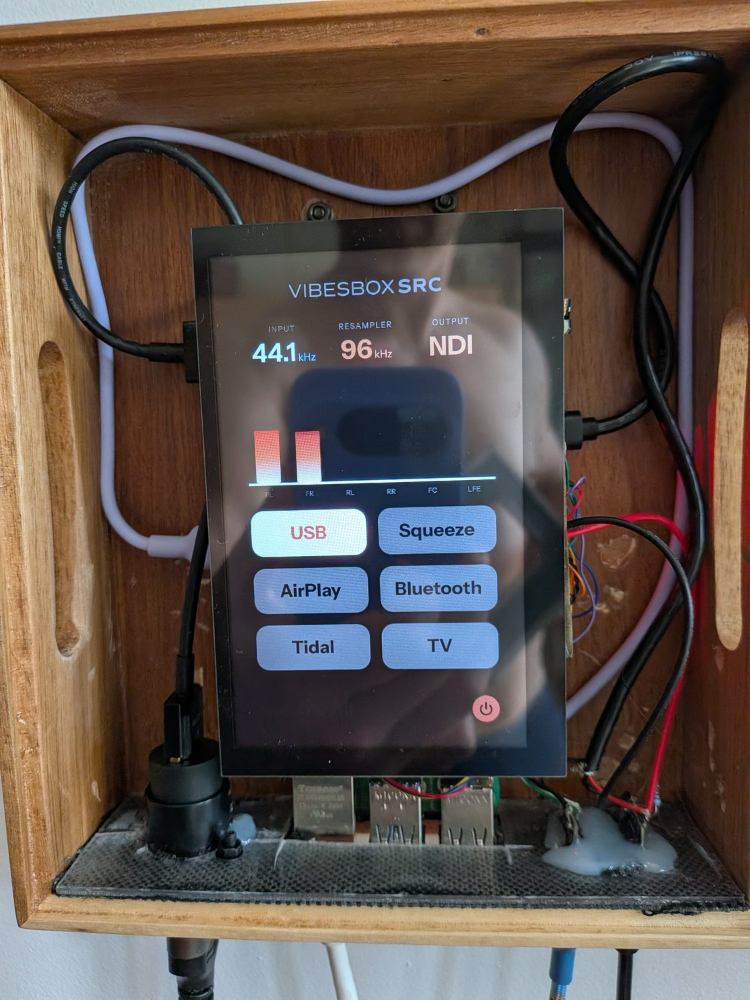
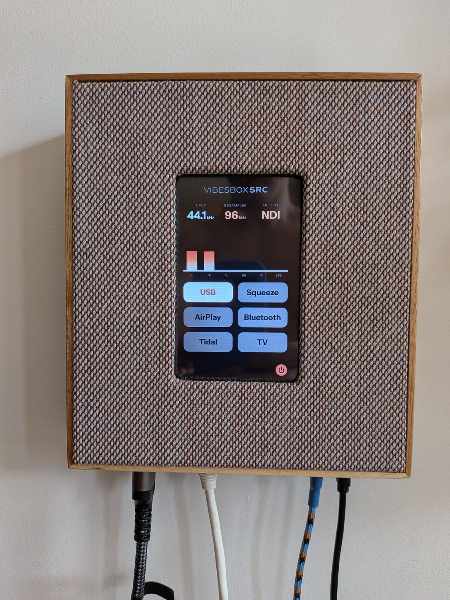

# ui-qml/ — the touchscreen dashboard

The interface on the 5" panel attached to the Pi. Pure QML with no C++ or Python shell —
it runs under the stock `qml` runtime, and both WebSocket connections are handled by the
QtWebSockets QML module with the logic written in QML JavaScript.

It renders **straight to KMS/DRM via Qt eglfs**, with no compositor underneath. There is no
desktop, no window manager, and no browser: `greetd` logs in and launches
[`../scripts/kiosk.sh`](../scripts/kiosk.sh), which execs the QML runtime directly. For an
appliance whose display only ever shows one full-screen app, a compositor is a layer that
can only add latency and failure modes.

## What it shows



Source buttons with per-source state, level meters, Now Playing, a power menu and a
brightness slider. State comes from `source_router.py`'s WebSocket on `:8080`; the RMS
meters come from CamillaDSP's own WebSocket on `:1234`. Both are read-only subscriptions
apart from the control messages the buttons send back, so the touchscreen and the remote
dashboard are always looking at the same truth.

The three figures across the top are the whole system in miniature: the source's real rate
in, 96 kHz through the resampler, NDI out. Below them the six meters are the sum bus
channels — with a stereo source playing, FL and FR move and the other four sit silent,
which is what "no upmixing here" looks like in practice.



Installed. The panel reads through the grille cloth, which is why the design leans on large
type and colour rather than fine detail — anything subtler disappears behind the weave.

Source state is communicated by colour rather than text — grey idle, white and glowing when
lit, breathing between grey and accent when muted. Bluetooth additionally shows the
connected device's name, and pulses a cyan border while pairing.

## Resolution independence

The layout is authored in **480×800 design pixels** for the portrait panel. `Main.qml` sets
`Theme.scale` from the actual window size and every dimension passes through `Theme.s(px)`,
so any other resolution renders the same UI uniformly scaled and centred. Retargeting a
different-sized screen needs no edits; only a genuinely different *aspect ratio* would
require touching the anchor chain.

The panel scans out 800×480 landscape natively and `Main.qml` rotates the portrait canvas
into it. Touch input goes through the same item transform, so no compositor rotation or
calibration matrix is involved.

## Fonts

`fonts/` holds **static instanced** TTFs, not the variable font used by the web dashboard.
Qt's eglfs font loading does not handle variable fonts and fails silently — text just
renders in a fallback face. If the UI ever looks subtly wrong, check this first.

## Dependencies

```
qt6-declarative-dev-tools                 # the /usr/lib/qt6/bin/qml runtime
qml6-module-qtquick
qml6-module-qtquick-window
qml6-module-qtwebsockets
qml6-module-qt5compat-graphicaleffects    # RectangularGlow
libqt6svg6                                # SVG image plugin (logos, icons)
```

Logo SVGs are referenced from the sibling [`../ui/`](../ui/) directory, so deploy the two
next to each other as `install.sh` does.

## Running it

```bash
# Against a remote Pi, from any desktop with Qt installed:
qml Main.qml -- --host=vibesbox-src.local
```

On the Pi itself the kiosk script owns the display. QML has no live reload here, so after
deploying changed files restart the session with `sudo systemctl restart greetd`.
